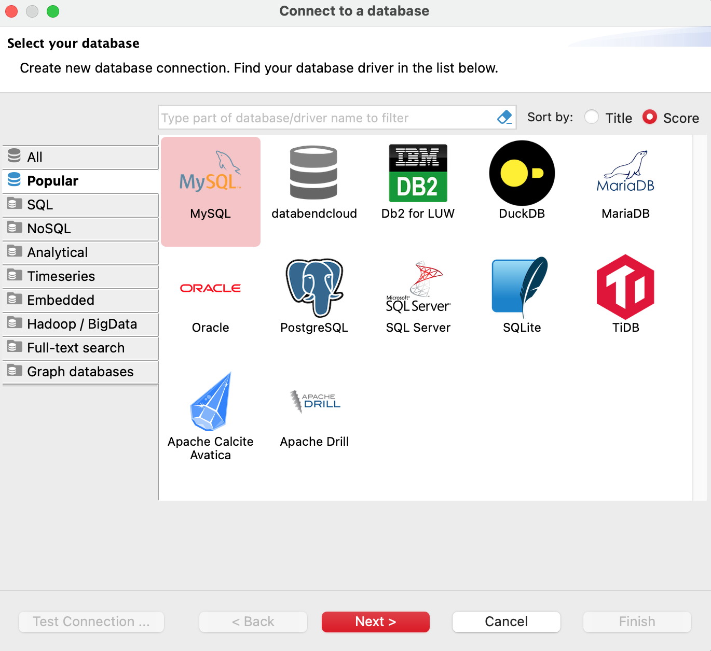

Early this month, I posted introducing bendsql, a CLI tool developed by the Databend team. The tool enables you to connect to your Databend instance, view your databases and tables, and even execute SQL queries in a command line window. However, for a more user-friendly experience, most of us prefer a GUI tool.

[DBeaver](https://dbeaver.com) is one of the most popular data management tools. It is free, open-source, and supports connections to almost all databases. This post explains how to set up a Databend connection with DBeaver. If you're a new Databender and haven't used DBeaver before, I hope this post can get you started.

When you set up a connection in DBeaver, you need to select a database driver. To connect to Databend, you can use the pre-configured MySQL driver, or add the [Databend JDBC driver](https://github.com/databendcloud/databend-jdbc) to DBeaver.

## Connecting with MySQL Driver

The MySQL driver is a pre-configured database driver in DBeaver, so when you create a connection on **Database** > **New Database Connection**, you can select it directly in the connection wizard and proceed.

Detailed connection steps are included in the Databend documentation.: https://databend.rs/doc/integrations/access-tool/mysql#example-connect-from-dbeaver

## Connecting with Databend JDBC Driver

The Databend JDBC driver is not a pre-configured database driver in DBeaver, so you have to add it to DBeaver using the Driver Manager before using it.

For how to add the driver to DBeaver, refer to https://databend.rs/doc/integrations/access-tool/jdbc#step-1-add-databend-jdbc-driver-to-dbeaver

After the driver is added to DBeaver, you can find and select it in the database connection wizard when creating a connection. The connection steps are the same as [Connecting with MySQL Driver](#connecting-with-mysql-driver).